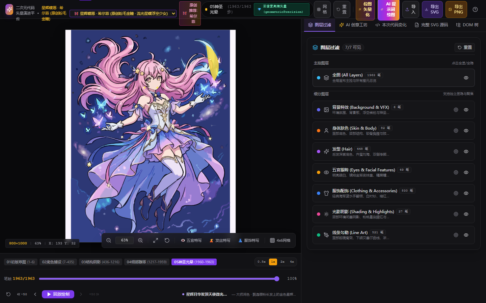
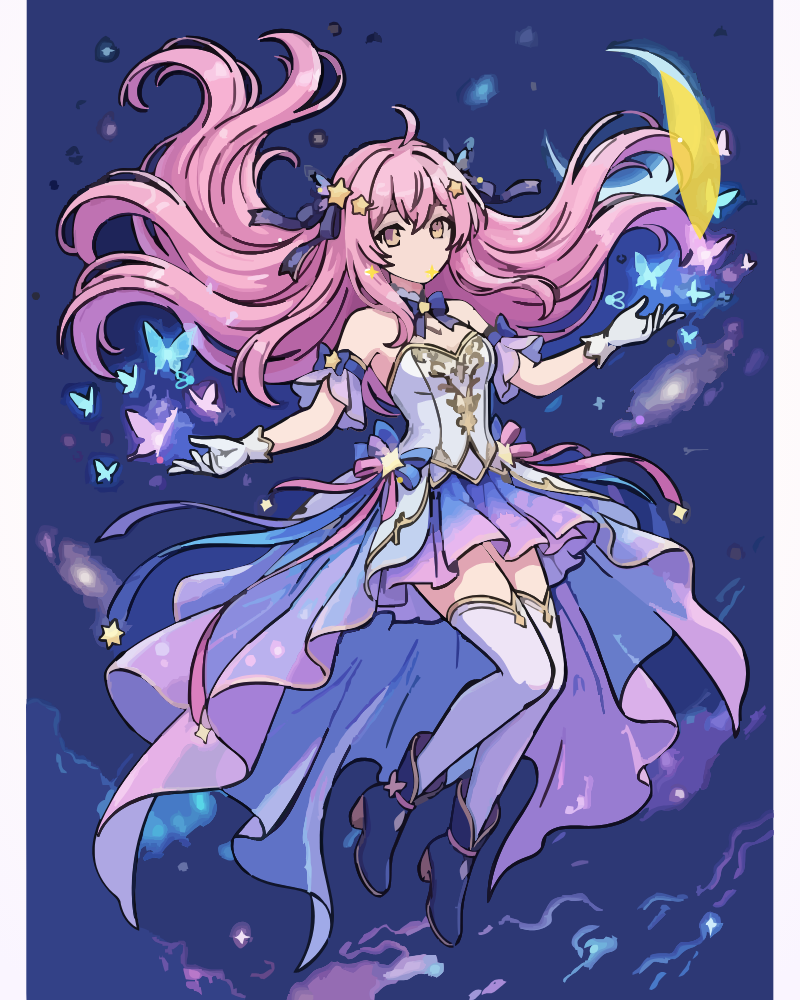

# 🎨 AI Vector Anime Studio (二次元 AI 代码矢量图绘制与过程回放开发平台)

<p align="center">
  
</p>

<p align="center">
  <a href="README_EN.md"></a>
  <a href="README.md"></a>
  <a href="https://nodejs.org/"></a>
  <a href="https://react.dev/"></a>
  <a href="https://vitejs.dev/"></a>
  <a href="LICENSE"></a>
</p>

<p align="center">
  <strong>基于 Web 的现代化二次元 AI 代码矢量图绘制、7 阶图层调试与微步过程回放开发平台</strong>
</p>

<p align="center">
  <a href="#-核心特性">核心特性</a> •
  <a href="#-艺术与技术架构">艺术与技术架构</a> •
  <a href="#-矢量作品展示">矢量作品展示</a> •
  <a href="#-快速开始">快速开始</a> •
  <a href="#-测试与质量保障">测试与质量保障</a>
</p>

---

## 🌟 核心特性

- **✨ 多维度二次元特征生成引擎**：基于结构语义与动势骨架的矢量生成管线，支持发色、瞳色、身材比例、动作姿态与服饰特征的参数化解构，高保真生成多图层高精度矢量艺术作品。
- **📐 7 阶独立图层系统**：
  - `背景特效 (Background & VFX)`：星空宇宙、新月、极光与浮空光尘微粒；
  - `身体肤色 (Skin & Body)`：二次元肌肤底面、颈部与修长肢体结构；
  - `发型 (Hair)`：飘逸长发、齐眉刘海与双侧修颜发束；
  - `五官眼眸 (Eyes & Facial Features)`：渐变球盘、高光星点、瞳孔与睫毛；
  - `服饰配饰 (Clothing & Accessories)`：抹胸礼服、宫廷金丝刺绣、百褶波浪裙摆与缎带；
  - `光影阴影 (Shading & Highlights)`：面颊红晕、环境闭塞阴影与发丝反光点睛；
  - `线条勾勒 (Line Art)`：纯黑加重 DoG 墨线骨架，线条凝练清晰。
  - **支持独立显隐（Visibility Toggle）与独占聚焦（Solo Focus 模式，背景自动暗化 85% + 灰度）**。
- **🖌️ 纯净赛璐璐平涂与高精度墨线**：融合双边滤波大块面平涂与多尺度高斯差分（DoG）墨线提取算法，杜绝传统矢量化算法带来的油画斑块感与杂碎噪点。
- **⏱️ 笔画级绘制回放与五阶段演进时间轴**：
  - `01 初版草图` -> `02 底色铺设` -> `03 结构阴影` -> `04 细部雕琢` -> `05 神圣光晕`；
  - 支持 0% ~ 100% 时间轴精确定位、多倍速播放（0.5x / 1x / 2x / 4x）以及单步微调。
- **⚡ 毫秒级代码 Diff 与 DOM 树联动**：每一步矢量生成均实时同步展示增量 SVG 代码变更（绿色高亮 diff）、完整 XML 源码查看与 DOM 节点树。
- **🤖 内置创意辅助对话（Co-Pilot）**：支持自然语言创意对话，输入个性化人设需求即可生成动势解构卡片，并在画布上直接渲染或动态回放。
- **💾 无损工程导出**：支持一键导出合法独立的 `.svg` 矢量源文件（保留图层结构）以及超清 `.png` 渲染图。

---

## 🦋 矢量作品展示：《星辉蝶愿 · 希尔菲》

<p align="center">
  
</p>

- **人设特征**：流光粉发 (505 笔) · 璀璨金瞳 (49 笔) · 悬浮少女身材 · 抹胸金丝刺绣礼服 · 漫天星光琉璃蝴蝶与静谧新月
- **真实矢量笔触**：**1,963 真实高密度贝塞尔路径**
- **墨线骨架**：521 笔浓黑 DoG 墨线，支持亚像素高精几何抗锯齿 (`geometricPrecision`)。

---

## 🛠️ 技术栈

- **前端核心**：React 18、TypeScript、Vite
- **样式与组件**：Tailwind CSS、Lucide React
- **测试工程**：Vitest、React Testing Library（**464 项单元与端到端测试 100% 通过**）
- **矢量算法**：OpenCV (DoG 边缘提取、形态学处理)、Bilateral Filter、Bézier Spline Smoother

---

## 🚀 快速开始

### 1. 克隆仓库
```bash
git clone https://github.com/krantjohn/ai-vector-anime-studio.git
cd ai-vector-anime-studio
```

### 2. 安装依赖
```bash
npm install
```

### 3. 启动本地开发服务
```bash
npm run dev
```
打开浏览器访问 `http://127.0.0.1:5173/` 即可体验。

### 4. 构建生产包
```bash
npm run build
```

---

## 🧪 测试与质量保障

项目包含完善的单元测试、压力测试、极限对抗测试与端到端场景覆盖：

```bash
npm test
```

- **测试套件**：16 个测试套件，**464 / 464 测试全部通过**。
- 覆盖画布变换矩阵数学运算、7 阶图层状态机与 Solo 隔离、动态色彩迁移保护、SVG DOM 规范与代码差异生成。

---

## 📚 详细设计与测试文档

- [系统架构与特性清单 (Architecture & Feature Inventory)](docs/PROJECT.md)
- [测试基础设施与覆盖标准 (Test Infrastructure & Coverage)](docs/TEST_INFRA.md)

---

## 📄 开源许可

本项目采用 [MIT License](LICENSE) 开源许可。
